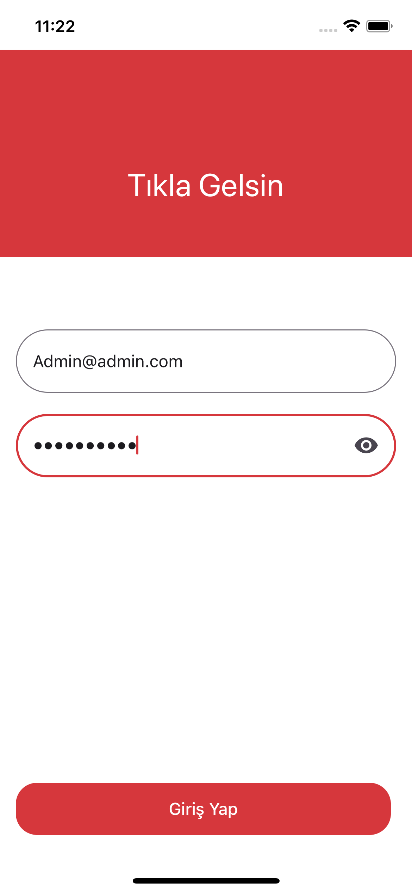
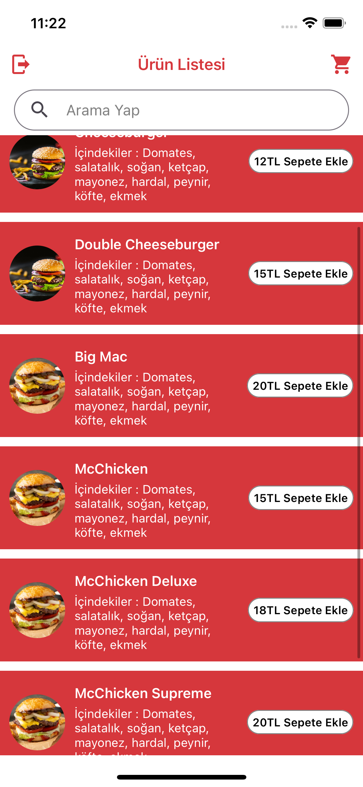
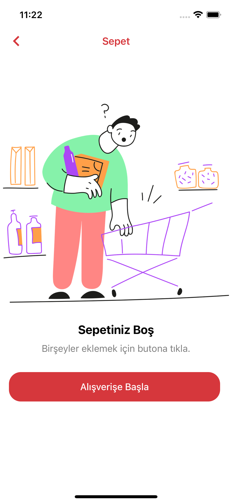
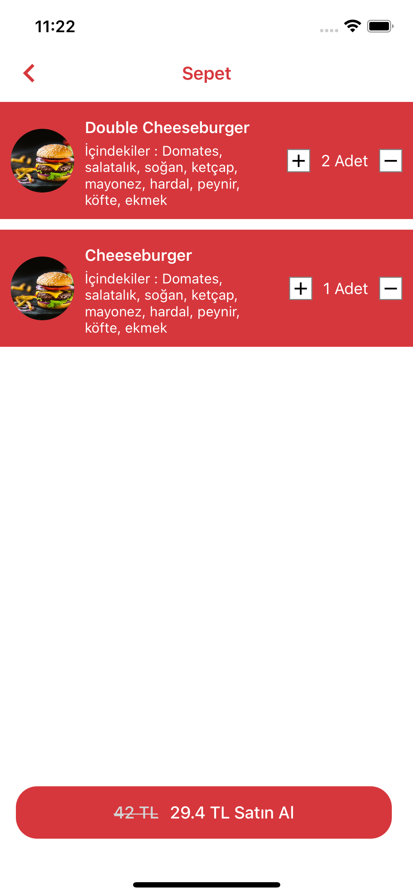

# Tıkla-Gelsin-Case

This README provides essential information for the tikla-gelsin-case.

## Login Information
### Email : admin@admin.com
### Password : admin.1234
---

## Getting Started

To run the project, use the following commands:

To run the project, start by installing the project dependencies using Yarn:

```bash
yarn install

After installing the dependencies, use the following commands:

Start Json Server
yarn json-server

Start the local server:
yarn start

Launch on Android:
yarn android

Run Tests
yarn test

Reverse local server with ADB For Android:
yarn adb
```






